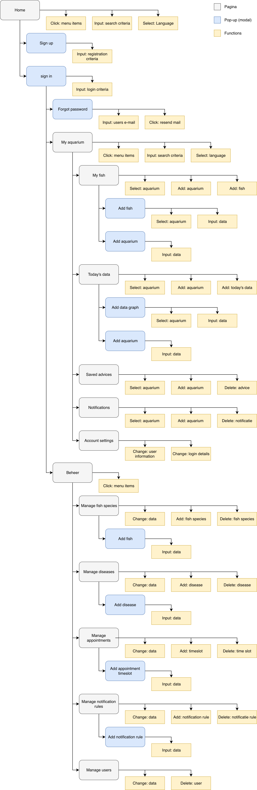

# Software architectuur
Dit hoofdstuk laat een overzicht zien van onze software architectuur.

## Overzicht
Hieronder staat een overzicht van de componenten waaruit ons product is opgebouwd en welke technieken daarbij gebruikt worden. De componenten worden daaronder kort beschreven.

* **Web Applicatie:** Een React applicatie waar elke bezoeker terecht komt.
* **Admin applicatie:** Een deel van de React applicatie waar de adminstrator de content voor de applicatie kan beheren, en geplande consults kan beheren en starten.
* **Chat:** Een deel van de WebApplicatie die dmv WebRTC een realtime peer to peer verbinding tussen een consultant en een geregistreerde gebruiker opzet. Hier kan gebruik worden gemaakt van videochat, tekstchat en het versturen van foto's.
* **Tekst chat log:** Een Firebase realtime database waar de tekst wordt gelogd.
* **Content Management REST API:** Een Express applicatie waar (met uitzondering van chat) al het dataverkeer afgehandeld wordt.
* **Database:** Firestore database waar alle gebruikersinformatie en applicatiecontent wordt bewaard en opgehaald.
* **Bestandssysteem:** Firebase Cloud Storage waar alle afbeeldingen worden opgeslagen.

## Web Applicatie
Hieronder staat een sitemap van de Web Applicatie, inclusief het administratieve gedeelte.

