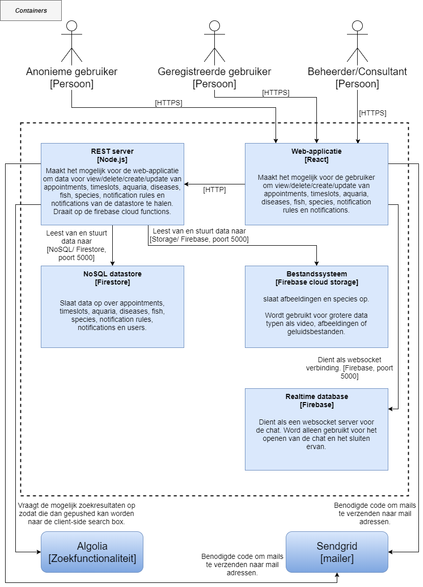
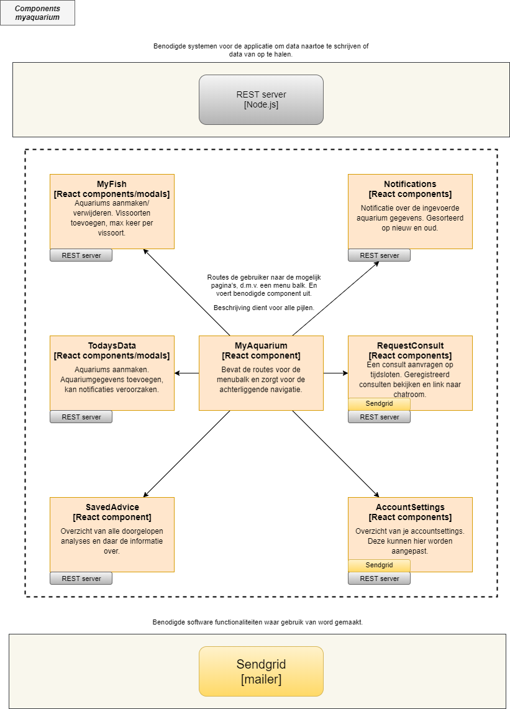

# Software guidebook Fish-team
DWA project 2017

* Mitch Dorrestijn,
* Sjoerd Scheffer,
* Ruud Mullenman,
* Roy Meijer,
* Jaap Weijland,
* Coen Severein.

----

## Inhoud

1. **Context**
  * *1.1 Gerald Bassleer.*
2. **Functional Overview**
  * *2.1 Zoeken van informatie over visziektes,*
  * *2.2 Analyse tool voor gebruikers met zieke vis(sen),*
  * *2.3 Bijhouden van aquarium gegevens,*
  * *2.4 Beheersystemen/CMS,*
  * *2.5 Inschrijven voor een consult,*
  * *2.6 Het consult gesprek.*
3. **Quality Attributes**
4. **Constraints**
  * *4.1 Budget,*
  * *4.2 Technologieën,*
  * *4.3 Design,*
  * *4.4 Ontwikkelmethode,*
  * *4.5 Opleveren.*
5. **Principles**
  * *5.1 Code principles,*
  * *5.2 Groeps principles*
6. **Software Architecture**
  * *6.1 System model,*
  * *6.2 Container model,*
  * *6.3 Component main model,*
  * *6.4 Component myaquarium model,*
  * *6.5 Component admin model,*
  * *6.6 Component chat model,*
  * *6.7 Component express model.*
7. **External Interfaces**
8. **Code**
9. **Infrastructure Architecture**
  * *9.1 Live omgeving,*
  * *9.2 Development omgeving,*
  * *9.3 Infrastructure diagram,*
  * *9.4 STUN-server,*
  * *9.5 Sidenotes.*
10. **Deployment**
11. **Operation and Support**
   * *11.1 React,*
   * *11.2 Firebase.*

----

## 1. Context
Dhr.   Burgers,   onze   opdrachtgever,   wil   samen   met   dhr.   Bassleer   een   applicatie   realiseren   die viseigenaren   in   staat   stelt   visziektes   vast   te   stellen.   Zij   hebben   een   studie   gemaakt   van visziekten   en   hebben   derhalve   veel   kennis   hierover   in   huis.

Dit   project   zal   worden   uitgevoerd   door   S.   Scheffer,   R.   Mulleman,   M.   Dorrestijn,   C.   Severein,   R. Meijer   en   J.   Weijland.   Zijnde   studenten   Hogeschool   van   Arnhem   en   Nijmegen   zijn   zij verantwoordelijk   voor   het   voltooien   van   het   project.

Er zijn al meerdere ICA-teams die aan de visanalysetool hebben gewerkt. Hieronder twee CMD-teams die het concept hebben uitgewerkt en een HTML en CSS-design hebben geleverd en een ICT-team wat een
databasestructuur heeft opgezet.

Het   project   is   opgezet   als   opdracht   vanuit   de   HAN.   Dit   proces   wordt   begeleid   door   de   volgende docenten:   mevr.   Danes,   dhr.   Leer   en   dhr.   Holwerda.

#### 1.1. Gerald Bassleer
“Meer   dan   38   jaar   ervaring   in   de   siervissen   industrie   als   bioloog,   vispathobioloog,   eigenaar, directeur,   CEO,   groothandel,   importeur   /   exporteur   van   siervissen,   visgezondheidsmanager, trainer   van   het   aquarium   personeel,   snelle   toepassing   van   microscopisch   onderzoek   en diagnostische   instrumenten,   consultant   voor   verschillende   bedrijven   in   verschillende   landen, auteur,   spreker,   ontwikkelaar   van   Dr.   Bassleers   Biofish   Food   met   Nutrikamenten,   ex-President van   OFI   (Ornamental   Fish   International,   2006-2016).   Publiceerde   app:   Fish   Ziekten   op   iOS   en Android,   alsook   de   nieuwe   e-course   Aquariology   (bij   Global   Pets   Academy).   Momenteel besteedt   hij   veel   tijd   met   reizen   rond   de   wereld   als   ”The   Flying   Fish   Doctor”   en   het   geven   van diensten   aan   de   industrie   om   het   welzijn   en   de   gezondheid   van   siervissen   te   verbeteren.”

(Parafrase   gebaseerd   op   informatie   van   Bassleer.com)

----

## 2. Functional overview
De webapplicatie die wordt gemaakt zal ervoor moeten zorgen dat een gebruiker:

- informatie kan vinden over de ziektes van hun vis,
- zelfstandig een analyse kan doorlopen om te kijken welke ziekte hun vis zou kunnen hebben,
- Aquarium gegevens invoeren en genotificeerd worden over mogelijke gevaren 
- een afspraak kan maken met een consultant,
- een gesprek kan voeren met deze consultant.

De webapplicatie zal tevens een beheersysteem bevatten dit bevat de volgende functionaliteiten:

- Beheer van vissen
- Beheer van ziektes
- Inzien van afspraken
  - Chatlogs inzien
  - Naar de chatroom navigeren
- Aangeven op welke tijden een consultant aanwezig kan zijn
- Notificaties regels aanpassen

#### 2.1 Zoeken van informatie over visziektes.
De gebruiker kan op de site van Bassleer een zoekterm invoeren in het zoekvenster en het systeem zal vervolgens de zoekresultaten laten zien. Hierna kan de gebruiker de zoekresultaten filteren op bijvoorbeeld vissen of ziekten.

#### 2.2 Analyse tool voor gebruikers met zieke vis(sen).
Dit is een tool in de webapplicatie die ervoor zorgt dat de gebruiker met zieke vis(sen) een analyse kan maken zonder contact met een specialist. De analyse heeft een vorm van een activity diagram op de achtergrond. Dit betekent dat bepaalde vragen een antwoord van de vorige vraag als pre-conditie hebben.

Het berekenen van het uiteindelijke resultaat zal gedaan worden d.m.v. een puntensysteem. Voor elk antwoord dat de gebruiker geeft worden punten aan mogelijke ziektes gegeven die vergelijkbare symptomen hebben.

Op het einde van de analyse wordt er een lijst getoond van ziektes die het meest overeenkomen. Bij deze uitkomsten wordt vervolgens bijbehorende informatie getoond, zoals een korte beschrijving, bijbehorende symptomen en een mogelijke behandeling voor de zieke vis.

#### 2.3 Bijhouden van aquarium gegevens.
Een gebruiker kan ook zijn aquariumgegevens bijhouden. Gegevens die we hieronder zoal zien zijn, vissen, tempratuur, iron en zuurstof. Aangezien verschillende vissen verschillende standaarden hebben voor deze waarden, is het van belang dat de gebruiker op de hoogte word gehouden van mogelijke gevaren. Dit wordt gedaan wanneer de gebruiker deze waarden invult of vissen aan zijn digitale aquarium toevoegt. Het systeem zal vervolgens nagaan of de waarden binnen acceptabele normen liggen. Zo niet, dan krijgt de gebruiker hier een notificatie van.


#### 2.4 Beheersysteem/CMS.
Informatie over vissen en ziektes en analysepunten kunnen worden beheerd in het CMS-gedeelte van de web-applicatie. In dit gedeelte kunnen alleen beheerders komen. Onder andere de volgende gegevens kunnen hier worden bewerkt:
* Vis ziekten (symptomen, beschrijving, behandeling)
* Vis soorten (leefomstandigheden, beschrijving)
* Analyse vragen (pre-conditie, symptomen, afbeelding, post-conditie)
* Notificatie regels (regels)
* Consult afspraken (wie, wanneer, waarover, bezetting)
* Consulten plannen (wanneer)

#### 2.5 Inschrijven voor een consult.
Als de gebruiker een consult wilt, kan hij hiervoor een afspraak inplannen. De gebruiker kan bij het maken van een afspraak een kleine beschrijving toevoegen en de datum + tijd kiezen uit een lijst. Deze lijst wordt door de consultant in het beheersysteem samengesteld. Hij kan hier aangeven wanneer hij tijd heeft voor een gesprek. Wanneer de gebruiker zich heeft ingeschreven zal het systeem een mail sturen naar de consultant en de aanvraag verwerken in het systeem.


#### 2.6 Het consult gesprek.
Het uitvoeren van een consult gesprek gebeurt ook via de web-applicatie. De applicatie krijgt de mogelijkheid om een videochat te starten. Voor gebruikers die geen beschikking hebben over een microfoon, zal er een mogelijkheid zijn om met de consultant te chatten d.m.v. tekst. Ook kunnen de gebruiker en de consultant afbeeldingen naar elkaar sturen.

----

## 3. Quality Attributes
Hier zullen de non-functionele aspecten worden verwoord.
* De webapplicatie is beschikbaar voor alle gebruikers met een browser.
* De webapplicatie ondersteunt de volgende browsers:
  * Microsoft IE 11+ (consultgesprekken)
  * Microsoft Edge 15+
  * Google Chrome 46+
  * Mozilla Firefox 52+
  * Safari 11+
* Het beheersysteem/CMS is alleen beschikbaar voor consultants/beheerders van de website.
* De videochat wordt niet ondersteund met het gebruik van Microsoft IE 11+.
* De code zal volgens de “code conventie” worden geïmplementeerd. Zie hoofdstuk 5.
* Het design is duidelijk geïnspireerd van het voorgaande CMD-groep, met kleine uitzonderingen waaronder het beheersysteem/CMS.
* Het product wordt geleverd met een softwareguidebook.

----

## 4. Constraints

Dit hoofdstuk biedt informatie over de beperkingen die zijn opgelegd aan de ontwikkeling van de website bassleer.nl.

#### 4.1 Budget

Omdat er geen formeel budget is voor bassleer.nl zijn we beperkt in het gebruiken van modules. Deze modules moeten namelijk open-source zijn.
Voor hosting en dataverkeer moeten kosten gemaakt worden.
Het meest ideale is dat de kosten hiervoor tijdens ontwikkeling, niet meer bedragen dan 2 euro per maand.

#### 4.2 Technologieën

Voor de website moet er gebruik worden gemaakt van een NoSQL database.
De NoSQL database die wij gekozen hebben is Google Firebase. Het is niet toegestaan om relationele databases te gebruiken omdat deze niet in het verlengde liggen van de DWA-course.

Naast het gebruik van een NoSQL database moet er gebruik gemaakt worden van React.js, Express.js en WebRTC. Voor WebRTC is tevens ook een HTTPS-verbinding nodig.

#### 4.3 Design

Het team is gebonden aan het design dat is aangeleverd door Gerald Bassleer. Deze is gemaakt door CMD studenten aan de Hogeschool van Arnhem en Nijmegen. Aanpassingen aan het design/extra implementaties kunnen plaatsvinden in overleg met de Product Owner.

#### 4.4 Ontwikkelmethode

Het team is beperkt in het kiezen van een ontwikkelmethode, er wordt namelijk verwacht dat het team gebruik maakt van Scrum.

#### 4.5 Opleveren
De website moet vóór 19-01-2018 worden opgeleverd. Als deze deadline niet gehaald wordt, kan moet het team vroegtijdig de Product Owner op de hoogte brengen.

----

## 5. Principles

In dit hoofdstuk worden de software principles toegelicht. Software principles zijn regels waaraan ieder groepslid zich moet houden om elkaars code te kunnen begrijpen. Groepsprinciples zijn regels om ervoor te zorgen dat het project optimaal verloopt.

#### 5.1 Code principles
**Algemeen**
1. Gebruik tabs, geen spaties,
2. Altijd spaties rondom operators ( = + - * / ),
3. Statements beëindigen met puntkomma’s,
4. Waar mogelijk niet meer dan 120 karakters op een regel.

**Control structures**
1. Spatie voor haakje openen,
2. Normale string declaraties worden aangegeven met enkele quote(‘) ipv dubbele quote(“).

**Benamingen**
1. Alle namen starten met een letter uit het Nederlandse alfabet,
2. Bij meerdere woorden aan elkaar wordt camelCasing gebruikt (met uitzondering van klassen).

**Functies**
1. Camel casing (functionName),
2. Accolade aan het einde van de eerste regel,
3. Spatie voor accolades,
4. Beëindigings accolade op nieuwe regel.

**Klassen**
1. Namen van klassen maken gebruik van Pascal case (ClassName).

**Variabelen**
1. Maak variabelen altijd aan met const of let. Gebruik geen var.

**Objecten**
Objecten worden als volgt gedefineerd:
```javascript
const person = {
	firstName: "John",
	lastName: "Doe",
	age: 50,
	eyeColor: "blue"
};
```

Wanneer het niet zeker is hoe de code gestyled moet worden, kijk dan naar dit document: 
https://google.github.io/styleguide/jsguide.html

#### 5.2 Groeps principles

1. Werktijden zijn van 8:45 tot 16:45,
2. Er wordt gewerkt op de Hogeschool van Arnhem en Nijmegen,
3. De dagelijkse scrum meeting vindt plaats om 9:30,
4. Men heeft een half uur pauze van 12:00 uur tot 12:30 uur. Dit kan afwijken i.v.m. andere
  afspraken op die dag,
5. Men zet in de gezamenlijke kalender wanneer men niet of anders aanwezig is dan
  eerder afgesproken,
6. Elke teamgenoot mag niet meer dan twee items in progress hebben,
7. Elke teamgenoot wordt geacht het Scrumbord bij te houden,
8. Inhoudelijke meldingen worden gedaan via Slack in het daarvoor bestemde kanaal.
9. Whatsapp wordt gebruikt voor informele of vlugge mededelingen.

----

## 6. Software architectuur
Dit hoofdstuk laat een overzicht zien van onze software architectuur.

#### 6.1 System model.
In het onderstaande model word een overzicht gegeven van de aplicatie en de relatie hiermee met gebruikers en andere softwarepacketten.


#### 6.2 Container model.
Hieronder staat het container model. Dit model geeft weer wat er werkend moet zijn om ervoor te zorgen dat de aplicatie werkt. 


#### 6.3 Component main model.
Het onderstaande component model geeft de functionaliteiten weer, soms worden deze functionaliteiten verder verdeelt in een los component diagram. Dit is het geval bij de components met een gekleurde rand eromheen. Het component model met dezelfde kleur schema zal de opdeling van dit component beter weergeven.


#### 6.4 Component myaquarium model.
Een uitbereidingde weergave van de "MyAquarium" component in het "Component main model".


#### 6.5 Component admin model.
Een uitbereidingde weergave van de "Admin" component in het "Component main model".


#### 6.6 Component chat model.
Een uitbereidingde weergave van de "Chat" component in het "Component main model".


#### 6.7 Component express model.
Een uitbereidingde weergave van de "Express" component in het "Component main model".


----

## 7. External Interfaces

#### Internal

Een Node js server wordt ingezet waarop een react applicatie draait. Via https requests naar een firebase server worden alle data interacties gehandeld.

#### External

###### Firebase

Er wordt in de applicatie gebruik gemaakt van de volgende firebase producten:

###### [Real-time database](https://firebase.google.com/docs/database/)

Wordt gebruikt voor om de webrtc verbinding op te zetten.

**[Cloud functions](https://firebase.google.com/docs/functions/)**

Deze functies worden gebruikt als triggers voor:

- Het bijhouden van de Algolia zoek indexes
- Notificaties
- Tijdslot einddatums bereken

**[Cloud Firestore](https://firebase.google.com/docs/firestore/)**

Cloud Firestore is een NoSql scalable cloud database

In deze database wordt alle data opgeslagen van de webapplicatie

**[Cloud Storage](https://cloud.google.com/storage/docs/)**

Cloud storage wordt gebruikt om images te versturen tussen twee clients.

**[Authentication](https://firebase.google.com/docs/auth/)**

Er wordt gebruik gemaakt van authentication module voor email verificatie.

Er wordt een verificatie token bijgehouden die kan worden geverifieerd.

**[Cloud messaging](https://firebase.google.com/docs/cloud-messaging/server)**

De Node.js server verbindt met een FCM server van google. Hierdoor kunnen notificaties worden gestuurd op smartphone en in de browsers.

###### [Sendgrid](https://sendgrid.com/docs)

Sendgrid is een cloudbased mail systeem. De Node.js server verbindt met deze mail server.

###### [WebRTC](https://webrtc.org/)

WebRTC is een API die er voor zorgt dat smartphones en browsers gebruik kunnen maken van Real-Time Communications (RTC) .

Wordt gebruikt voor realtime video chat en tekst chat.

###### [Algolia](https://www.algolia.com/doc/)

Algolia is een API wat gebruikt wordt voor zoekfunctionaliteit. Op Algolia zijn zoek indexen ingesteld.

De Node.js server verbindt met de API van Algolia en krijgt zoekresultaten terug.

----

## 8. Code

Het doel van dit hoofdstuk is om de implementatie details te beschrijven voor de delen van de code die belangrijk, complex of significant zijn.

#### **Structure**

In de [Create react app documentatie](https://github.com/facebookincubator/create-react-app/blob/master/packages/react-scripts/template/README.md) kan gevonden worden wat de structuur is van de applicatie. Er wordt gebruik gemaakt van JSX-code om HTML te genereren.

#### **Error handling**

###### Client

Errors worden server-side teruggegeven vanuiteen http-request. Wanneer de status van een http-request niet in de 200->300 range ligt wordt een melding van de http-request weergegeven indienmogelijk.

###### Server

Server side worden catches afgehandeld als eenserver operatie faalt. Wanneer dit gebeurd wordt een Error code gestuurd alsresponse. In de api-docs kunnen de responses gevonden worden.

#### Security

API's zijn alleen toegankelijk voor gebruikersdie geauthentiseerd zijn. Door middel van een unique authorisation token. Ditworden opgevangen in de middleware van de server.

----

## 9. Infrastructure Architecture

Dit hoofdstuk bevat informatie over de infrastructuur van de website.

#### 9.1 Live omgeving

De live omgeving is niet heel erg complex; het is namelijk een enkele cloud server gehost door Google's Firebase:
Opzet: https://firebase.google.com/docs/web/setup#host_your_web_app_using_firebase_hosting
Systeem: Node 8.9.1 LTS
Type: cloud server

#### 9.2 Ontwikkelomgeving

Voor ontwikkeling wordt er gebruik gemaakt van GitHub. In de 'development' branch worden alle elementen geplaatst, na een sprint review wordt deze branch gekopieerd naar de 'master'. De 'master' branch is altijd de laatste versie en is te zien op bassleer.nl.

#### 9.3 Infrastructure diagram
Op de onderstaande diagram is te zien hoe de communicatie vanuit Firebase naar de server en de client verloopt.


#### 9.4 STUN-server
De STUN (Simple Traversal of User Datagram Protocol [UDP] Through Network Address Translators [NAT’s]) server wordt gebruikt voor communicatie via WebRTC. WebRTC wordt gebruikt voor chatsessies. De STUN-server die gebruikt wordt, wordt aangeleverd door Google.

Een STUN server stelt NAT-clients (computers achter een firewall) in staat om telefoongesprekken op te zetten met een VoIP-provider buiten het lokale netwerk.
(Bron: https://www.3cx.nl/voip-sip/stun-server/)

#### 9.5 Sidenotes
Google Firebase is verantwoordelijk voor het updaten en onderhouden van de servers. Dhr. Bassleer is verantwoordelijk voor het maken van back-ups, de resources zijn staan ook op naam van Dhr. Bassleer.

----

## 10. Deployment
Dit hoofdstuk zal uitleggen welke stack er gebruikt wordt om het product te draaien.

#### 10.1 Software
De omgeving van productie zijn de servers van Firebase. Firebase draait op Google App Engine. De volgende producten worden gebruikt bij deployment:
- Firebase Cloud Functions (NodeJS omgeving, Node v6.11.5.),
- Firebase Firestore (NoSQL database),
- Firebase Cloud Messaging (Push Notifications service),
- Firebase Realtime Database (Structured Real Time Database),
- Firebase Hosting (hosting van statische files),
- Firebase Authentication (user management),
- Firebase Storage (Voor het dynamisch uploaden van files, zoals images).

#### 10.2 Build
Het is niet nodig om dit project te builden.

#### 10.3 Deploy
Om het project te deployen naar de servers van Firebase, navigeer naar de map /functions, en type "firebase deploy". Mocht je alleen bepaalde facetten willen deployen, doe dan firebase deploy --only functions[,firestore,...].

#### 10.4 API Keys & andere configuratie
Om de applicatie te kunnen draaien, heb je de volgende API-Keys nodig:
- Firebase Admin. Deze "key" lever je aan in de vorm van een serviceAccount.
- Firebase Storage. Hiervoor is geen key nodig, wel enige configuratie.
- Algolia. De keys die nodig zijn om deze service te gebruiken, zijn de "access key" en de "admin key".
- SendGrid. Hiervoor is 1 API-key nodig.

De applicatie maakt gebruik van Cloud Functions Triggers. Deze draaien niet lokaal, maar op de live Firebase-server. Deze triggers zijn nodig om reads en writes naar Firestore te verwerken. De applicatie werkt niet goed zonder deze triggers.

Om deze triggers te activeren, moet men de applicatie deployen naar de live server. Dit kan met `firebase deploy --only functions`. Aangezien Firestore altijd live draait, werken de triggers ook alleen op de live server. Mocht je de server lokaal draaien, dan worden de triggers niet aangeroepen wanneer in Firestore een read of write uitgevoerd wordt.

##### 10.4.1 Firebase Admin
Om hiervan de keys te krijgen, dien je deze(https://firebase.google.com/docs/admin/setup#add_firebase_to_your_app) stappen te volgen. Als het goed is heb je nu een .json bestand gedownload (standaard naam; private_key.json). Dit is de zogenaamde service file. Plaats deze file in de root van het Cloud Functions-project, in dit geval in de map ~/firebase/functions. Zorg ervoor dat dit bestand 'geinclude' wordt in de `index.js`. De include-functie staat op het moment van schrijven op regel 5 van index.js:
```const serviceAccount = require("./private-key.json");```
Firebase Admin zou nu moeten draaien. Mocht je er niet uitkomen, dan kan je altijd navigeren naar je "Project Settings", tabje "Firebase Admin SDK". Hier staat uitgelegd wat je moet doen om je SDK toe te voegen.

##### 10.4.2 Firebase Storage
Om storage toe te voegen, voeg de regel `storageBucket: '****.appspot.com'` toe aan het `admin.initializeApp()` object, zodat hij er zo uit komt te zien:

```
admin.initializeApp({
	credential: admin.credential.cert(serviceAccount),
	databaseURL: "https://****.firebaseio.com",
	storageBucket: '****.appspot.com'
});
```
Wat er op de plek van de sterretjes moet komen te staan, is te vinden in de console onder de tab "storage".

##### 10.4.3 Algolia
Om Algolia werkend te krijgen, moet je 2 keys verkrijgen: de "access key" en de "admin key". Deze zijn eenvoudig te verkrijgen wanneer je je hebt geregistreerd bij Algolia. Zie de documentatie van Algolia om erachter te komen hoe dat moet. Wanneer je deze keys hebt, dien je de keys te vervangen die zijn gedefinieerd op regel 20 en 21 in `index.js`.

##### 10.4.4 SendGrid
Om SendGrid werkend te krijgen, heb je 1 key nodig. Deze kan je verkrijgen door je te registeren op sendgrid.com. Zie de documentatie van SendGrid om erachter te komen hoe deze key te verkrijgen is. Wanneer je deze hebt ontvangen, vervang dan de key de te vinden is op regel 2 in `mailer/mailer.js`.

----

## 11. Operation and Support
In dit hoofdstuk wordt uitgelegd hoe de site kan worden onderhouden en hoe alles moet worden opgestart.

#### 11.1 React
De website is gemaakt met React. Om de site te draaien op een web-server moet je een "production build" maken van het React project. Dit doe je door het volgende commando te gebruiken:

```npm run build```

In de hoofdmap van het React project komt een mapje genaamd "build" te staan. Hierin zitten alle benodigde bestanden om de site te draaien op een web-server. Alle JavaScript bestanden zijn hierbij samengevoegd tot een groot javascript bestand.

Om de site lokaal te draaien voor ontwikkeling kan je het volgende commando gebruiken:

```npm start```

Nadat je dit commando hebt uitgevoerd, wordt er in je browser een tab geopend waarop de site te zien is. Als je, terwijl de development server draait, een wijziging maakt in de code, dan wordt dit direct gewijzigd in de browser. Je hoeft hiervoor niet de site opnieuw te laden.

#### 11.2 Firebase
Voor zaken die te maken hebben met het opslaan van gegevens wordt er gebruik gemaakt van Google's Firebase. Firebase kan lokaal en op de servers van Firebase gedraaid worden. Tevens biedt Firebase ook de mogelijkheid om gratis de site te hosten.

Om Firebase te kunnen gebruiken moet je de Firebase CLI installeren op je computer.

[https://firebase.google.com/docs/cli/](https://firebase.google.com/docs/cli/)

Om Firebase lokaal te draaien gebruik je het volgende commando:

```firebase serve --only hosting,functions```

Om de bestanden van Firebase online te zetten gebruik je:

``` firebase deploy --only hosting,functions```

